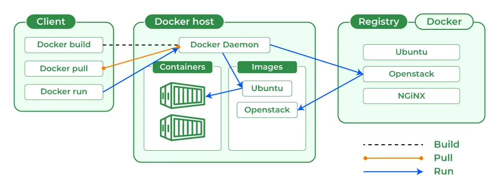
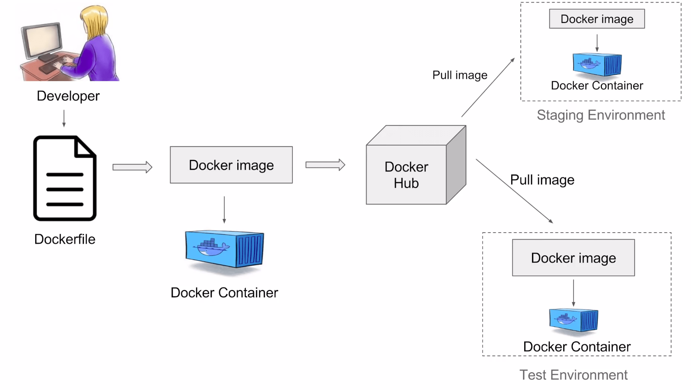

## Architecture



1. **Docker Client:**
    - The Docker client is the command-line interface (CLI) or graphical user interface (GUI) that users interact with to build, manage, and control Docker containers.
    - It sends commands to the Docker daemon to perform various tasks.
2. **Docker Daemon:**
    - The Docker daemon is a background process that manages Docker containers on a host system.
    - It listens for Docker API requests and takes care of building, running, and managing containers.
3. **Docker Registry:**
    - Docker images can be stored and shared through Docker registries.
    - A Docker registry is a repository for Docker images, and it can be public (like Docker Hub) or private.
4. **Docker Hub:**
    - Docker Hub is a cloud-based registry service provided by Docker, where users can find, share, and store Docker images.
    - It serves as a central repository for Docker images.

Here's a high-level overview of the interaction between these components:

-   The Docker client communicates with the Docker daemon, sending commands and receiving information about containers, images, etc.
-   Docker images are fetched or built from the Docker registry.
-   Containers are created, started, stopped, and managed by the Docker daemon.

## Workflow



## Get started

1. Create the file Dockerfile
2. Build the project

```bash
docker build -t mytodoapp .
```

3. Run the project

```bash
docker run -it -d -p 3000:3000 mytodoapp
```

## Todo

-   [ ] When I need to install another packages
